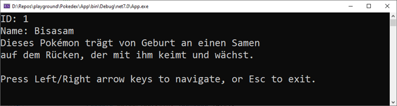
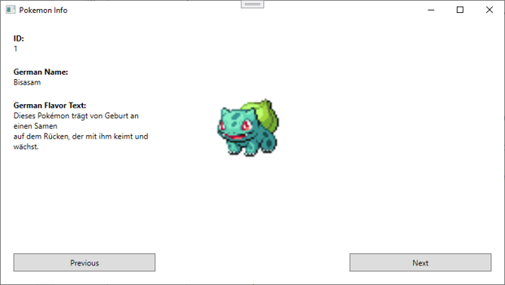

# Workshop Solutions

Cascade write mode with Claude 3.5 Sonnet

## Task 1

### Me
Please look at the data in the ./Data folder which contains multilingual data on the first 151 Pokemon as json. Look at the format of the json and then implement a .Net 6 console app like shown in the image.

## Task 2 (same cascade window)
### Me
Awesome work Claude! Now please add another GuiApp which uses the same data display a .net 6 wpf gui like shown in the image
